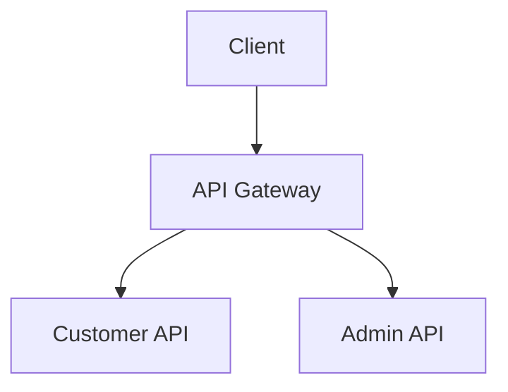
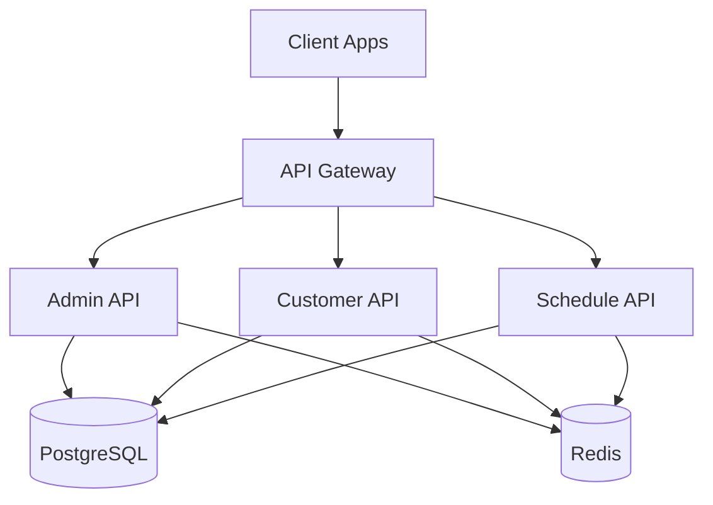
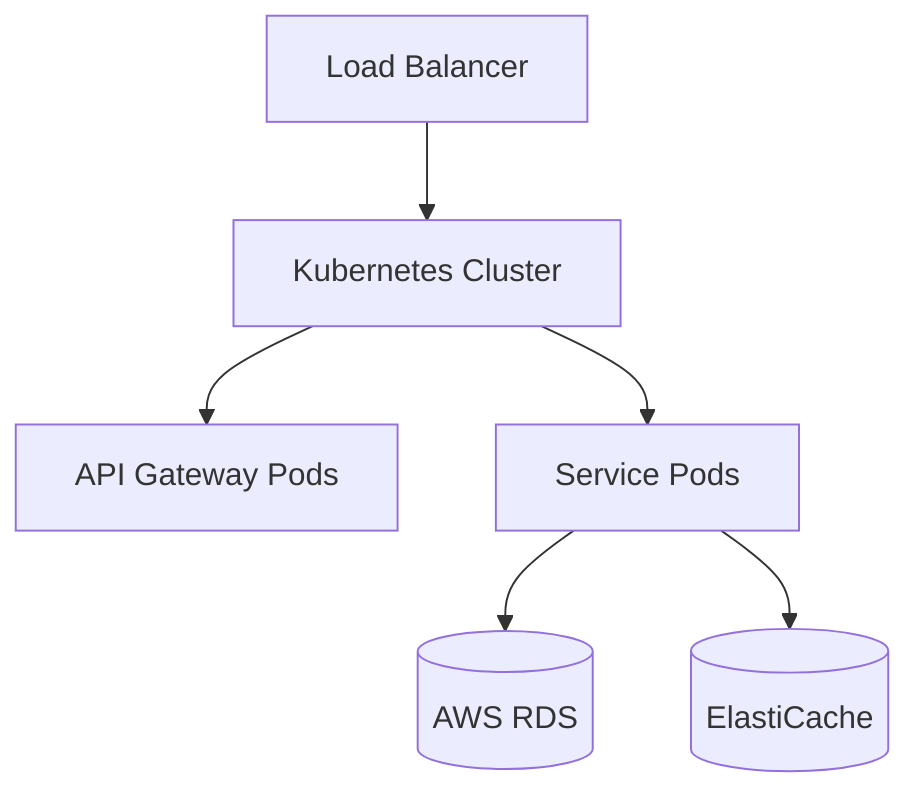

# Documentation

Central documentation hub for the monorepo template.

## Overview

This directory contains comprehensive documentation for the entire monorepo, including architecture decisions, API documentation, deployment guides, and development workflows.

## Documentation Structure

```text
documentation/
├── architecture/          # Architecture decisions and diagrams
├── api/                  # API documentation
├── deployment/           # Deployment guides
├── development/          # Development workflows
└── guides/              # How-to guides and tutorials
```

## Quick Links

### Getting Started

- [Setup Guide](./development/setup.md) - Initial setup and installation
- [Development Workflow](./development/workflow.md) - Daily development practices
- [Contributing Guidelines](./development/contributing.md) - How to contribute

### Architecture

- [System Architecture](./architecture/system-overview.md) - High-level system design
- [Microservices](./architecture/microservices.md) - Service architecture
- [Database Schema](./architecture/database.md) - Database design
- [Event Flow](./architecture/events.md) - Event-driven architecture

### API Documentation

- [API Gateway](./api/gateway.md) - Gateway endpoints and routing
- [Admin API](./api/admin.md) - Admin service endpoints
- [Customer API](./api/customer.md) - Customer service endpoints
- [Schedule API](./api/schedule.md) - Schedule service endpoints

### Deployment

- [Docker Deployment](./deployment/docker.md) - Docker and Docker Compose
- [Kubernetes Deployment](./deployment/kubernetes.md) - K8s deployment guide
- [AWS Deployment](./deployment/aws.md) - AWS infrastructure setup
- [CI/CD Pipeline](./deployment/cicd.md) - Continuous integration and deployment

### Guides

- [Authentication Flow](./guides/authentication.md) - Auth implementation guide
- [Database Migrations](./guides/migrations.md) - Managing database changes
- [Testing Strategy](./guides/testing.md) - Testing best practices
- [Logging Standards](./guides/logging.md) - Logging conventions
- [Error Handling](./guides/error-handling.md) - Error handling patterns

## Documentation Standards

### Writing Documentation

1. **Markdown Format**: Use Markdown for all documentation
2. **Clear Structure**: Use headings, lists, and code blocks
3. **Code Examples**: Include practical code examples
4. **Keep Updated**: Update docs when making code changes
5. **Screenshots**: Use screenshots for UI-related docs

### Code Examples

Always include language identifiers in code blocks:

```typescript
// Good
const example = 'This has a language identifier';
```

### Diagrams

Use Mermaid for diagrams:



## API Documentation

API documentation is auto-generated using OpenAPI/Swagger specifications. Access the interactive API docs:

- **Development**: `http://localhost:3000/docs`
- **Staging**: `https://staging-api.example.com/docs`
- **Production**: `https://api.example.com/docs`

## Architecture Diagrams

### System Overview



### Deployment Architecture



## Contributing to Documentation

1. Create a new branch for documentation changes
2. Add or update documentation files
3. Ensure all links work correctly
4. Submit a pull request with clear description
5. Request review from team members

## Documentation Checklist

When creating new features, ensure you document:

- [ ] API endpoints (request/response formats)
- [ ] Environment variables
- [ ] Configuration options
- [ ] Usage examples
- [ ] Error scenarios
- [ ] Testing instructions
- [ ] Deployment considerations

## Tools

### Documentation Generation

- **TypeDoc**: Generate API docs from TypeScript code
- **Swagger/OpenAPI**: Interactive API documentation
- **Mermaid**: Diagram creation
- **Markdown**: Standard documentation format

### Viewing Documentation

```bash
# Serve documentation locally
pnpm run docs:serve

# Generate API documentation
pnpm run docs:generate

# Validate documentation links
pnpm run docs:validate
```

## Resources

- [Markdown Guide](https://www.markdownguide.org/)
- [Mermaid Documentation](https://mermaid.js.org/)
- [OpenAPI Specification](https://swagger.io/specification/)
- [TypeDoc Documentation](https://typedoc.org/)

## Maintainers

Documentation is maintained by the development team. For questions or suggestions, please open an issue or contact the team.

## License

Documentation is part of the project and follows the same license terms.
